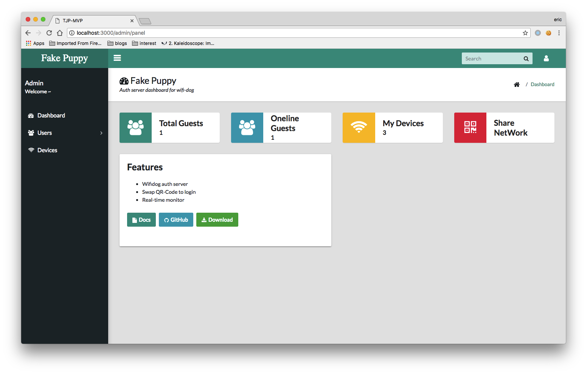
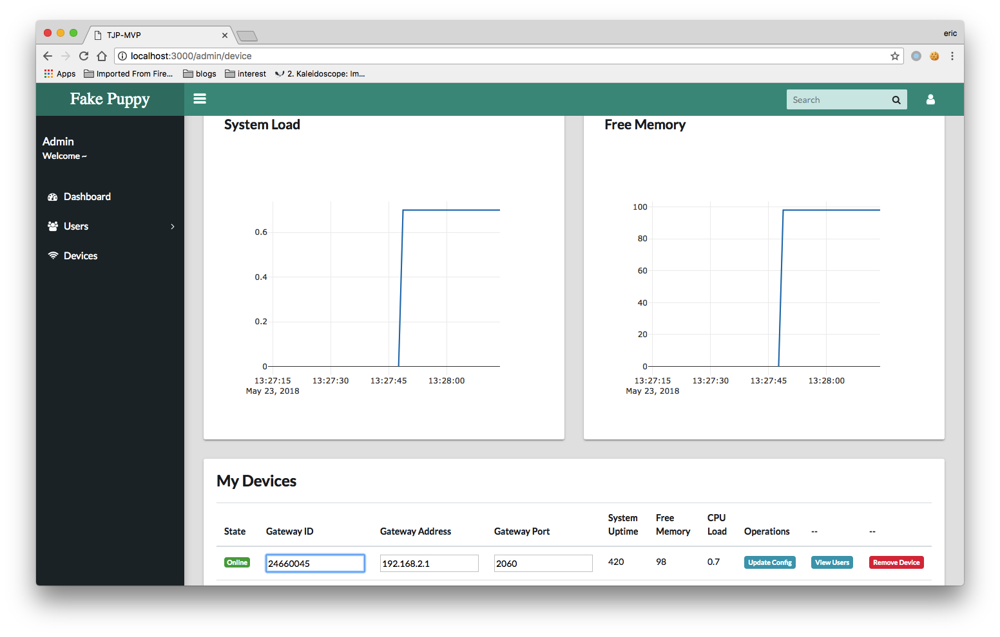
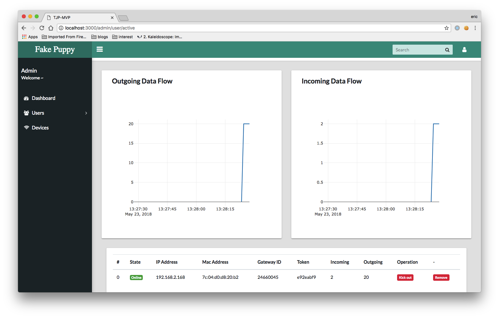

# fake-puppy

> Yet another auth server for wifi-dog

### Dependency

* MongoDB
* Node.js

### Features

* Swap QR-Code to login
* Real-time monitor

### Screenshots

> Dashboard



> View Devices



> View Users



### Deploy

```bash
git clone https://github.com/higuoxing/fake-puppy.git
cd fake-puppy
npm install
npm start
```

### ISSUES

> For any problems, please send me a issue or pr, have fun :)

### Acknowledgement

> Standing on the shoulders of giants!

* Special thanks for [vali-admin](https://github.com/pratikborsadiya/vali-admin)
* Special thanks for YiCheng-Ma and AiJun-Zhou
